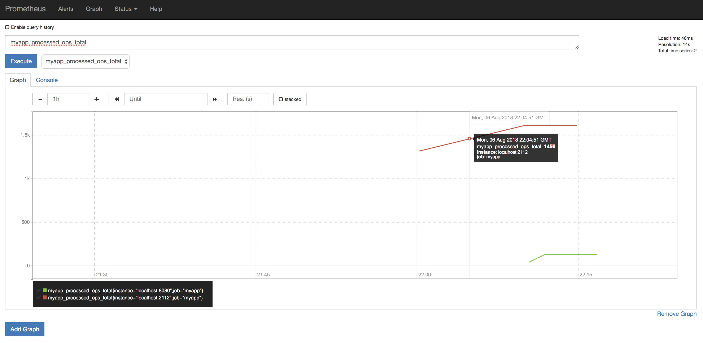

# Prometheus example
You need Go installed then do
```
make install
````
open in seperate terminals
```
make myapp
```
```
make prometheus
````

and go to http://localhost:9090 select your metric and excecute to view graph and console

